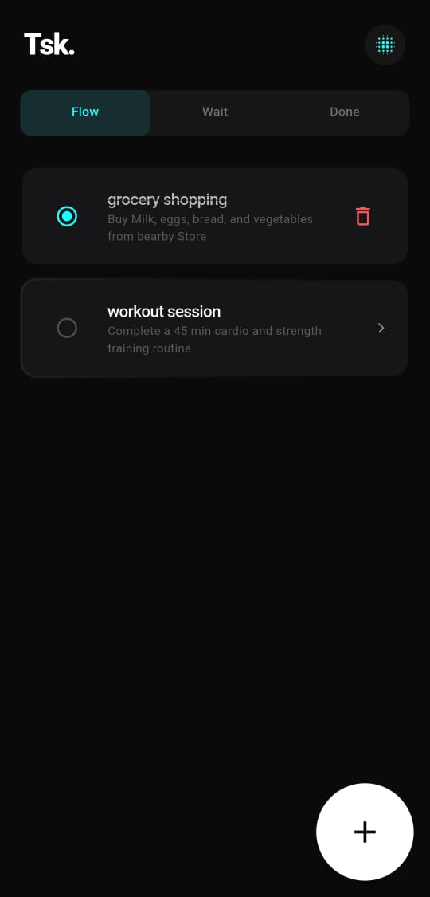
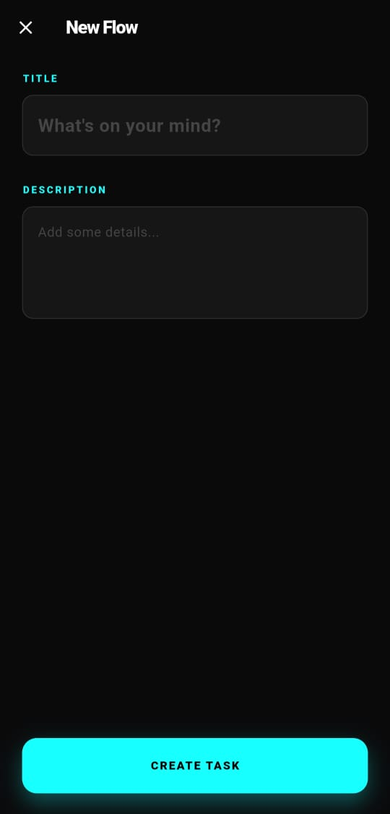
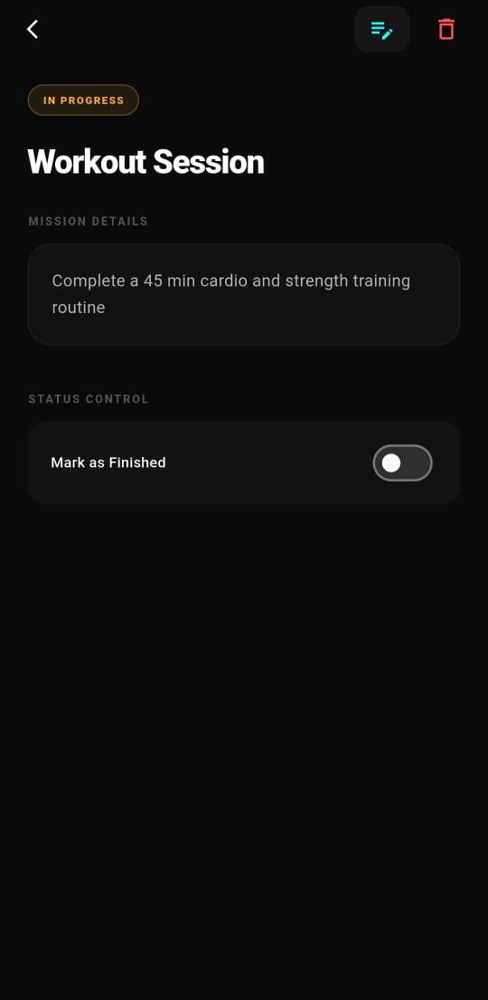
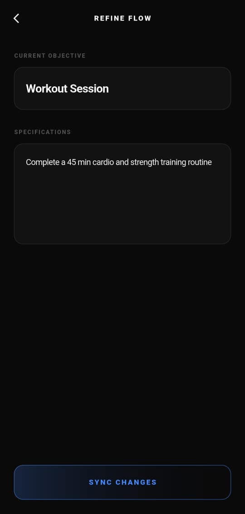
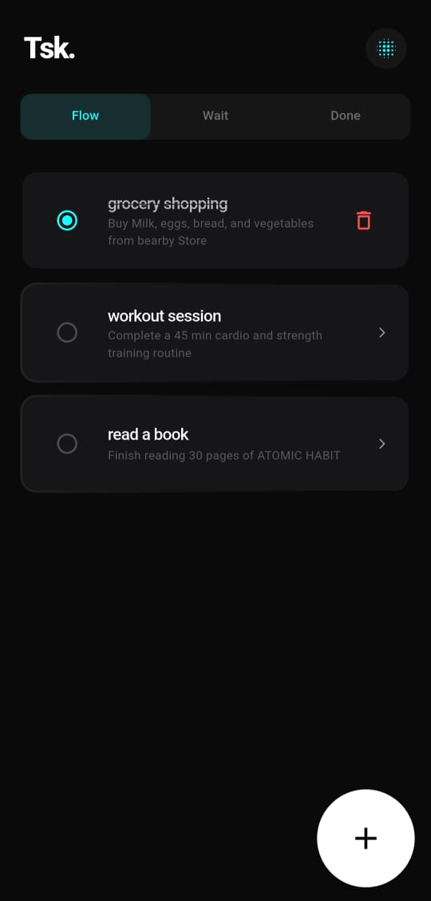
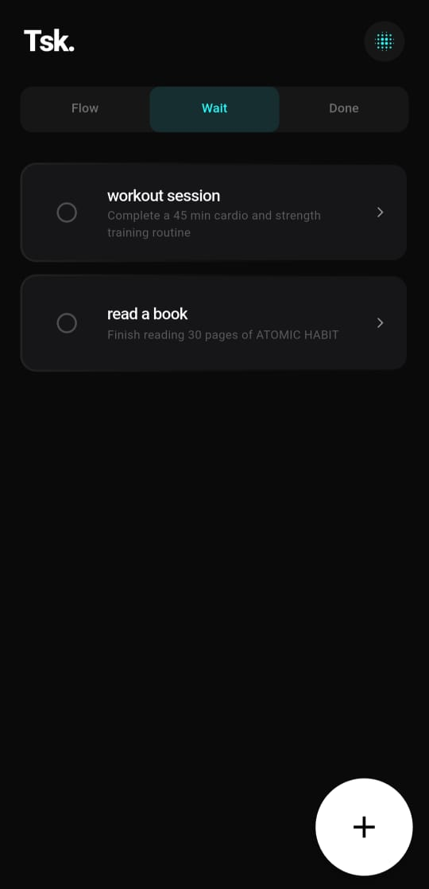
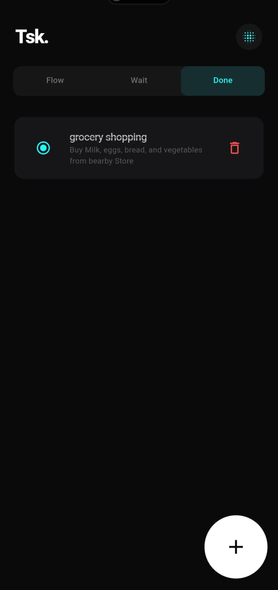

# Todo Hive App 🚀

A simple, clean, and fully functional **Flutter Todo App** built with **Hive local database** for local persistence.  
Easily add, view, edit, delete, and filter tasks with a clean and responsive UI.

---

## 🌟 Features

- Add new tasks with title & description  
- View task details  
- Edit existing tasks  
- Mark tasks as completed / pending  
- Delete tasks  
- Filter tasks: **All / Pending / Completed**  
- Persistent local storage with **Hive**  
- Clean and intuitive UI  

---

## 🛠️ Tech Stack

- **Flutter** — UI & State Management  
- **Hive & Hive Flutter** — Local database  
- **Dart** — Programming language  

---

## 📸 Screenshots

### Home Screen || Add Task Screen   || Task View Screen || Edit Task Screen  

  &nbsp;&nbsp;&nbsp;&nbsp;&nbsp;&nbsp;&nbsp;&nbsp;  &nbsp;&nbsp;&nbsp;&nbsp;&nbsp;&nbsp;&nbsp;&nbsp;  &nbsp;&nbsp;&nbsp;&nbsp;&nbsp;&nbsp;&nbsp;&nbsp;  

### Filter Tabs (All / Pending / Completed) 

  &nbsp;&nbsp;&nbsp;&nbsp;&nbsp;&nbsp;&nbsp;&nbsp;  &nbsp;&nbsp;&nbsp;&nbsp;&nbsp;&nbsp;&nbsp;&nbsp;  

---

## ❤️ Thank You

Thank you for checking out my project!  
This app demonstrates **clean architecture, reactive UI with Hive, and simple Flutter best practices** — perfect for portfolio or interview showcase.
