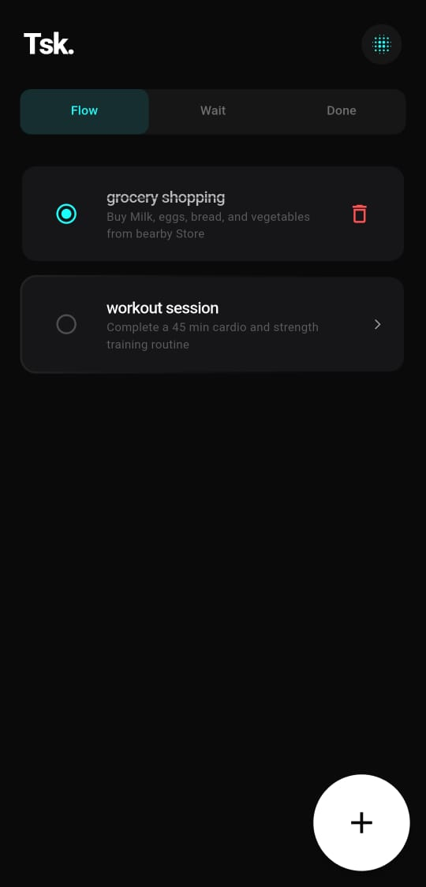
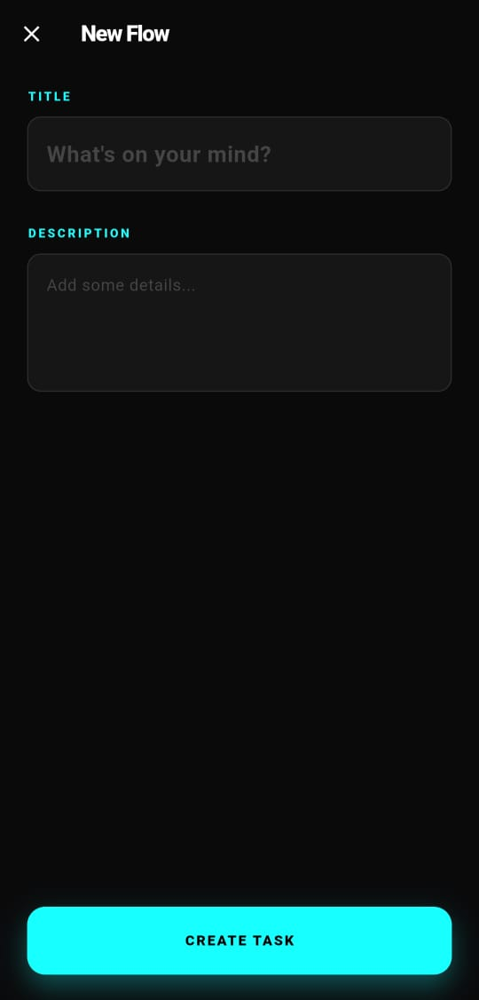
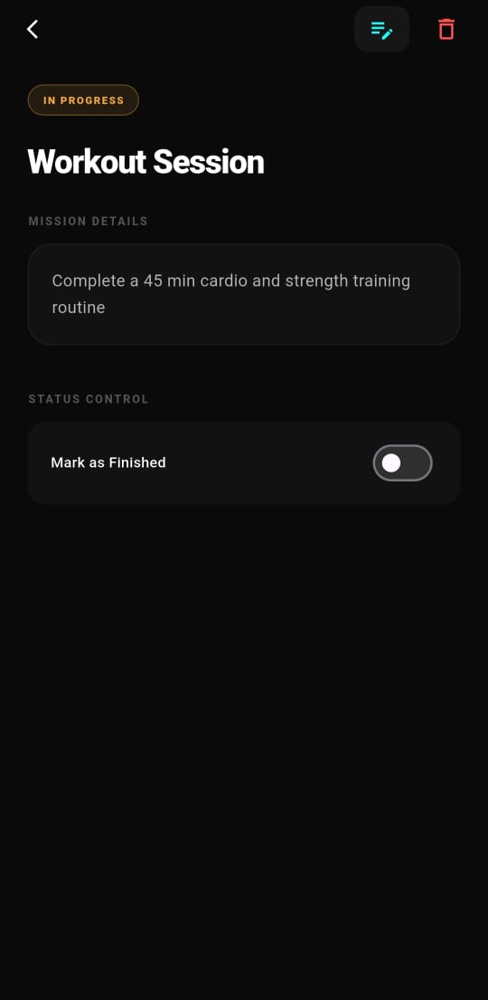
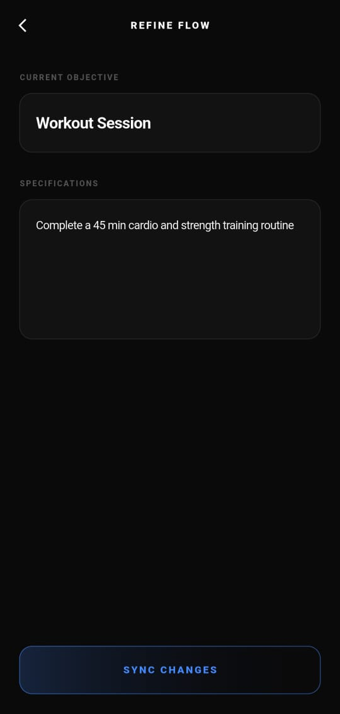
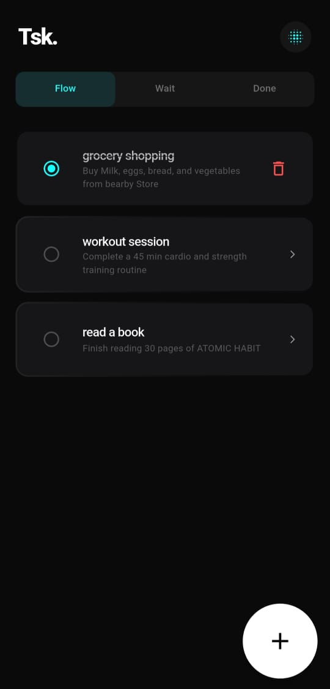
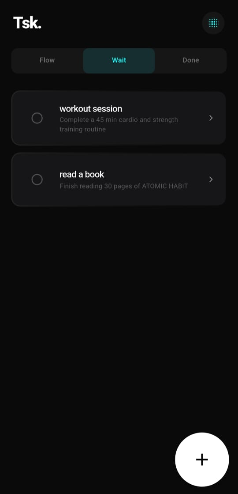
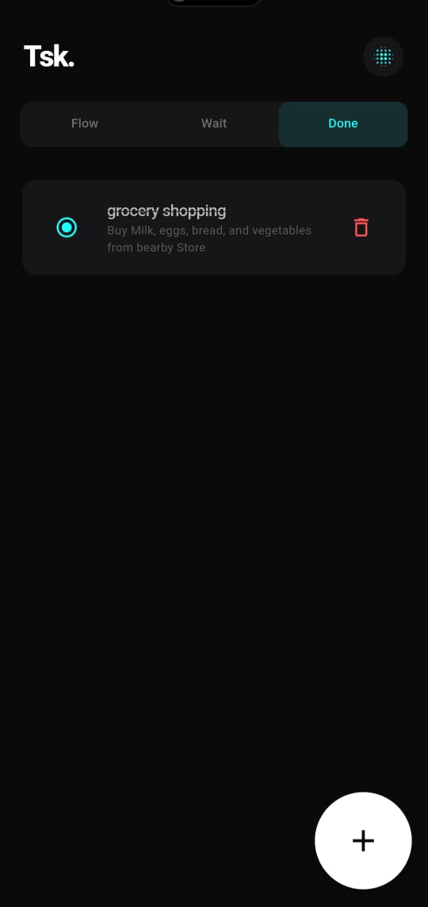

# ✅ Todo Hive App

A simple, clean Flutter todo app built with Hive for local persistence. Add, view, edit, delete, and filter tasks with a responsive UI — no backend required.

---

## 🌟 Features

Add new tasks with title and description. View task details. Edit existing tasks. Mark tasks as completed or pending. Delete tasks. Filter by All, Pending, or Completed. Persistent local storage with Hive.

---

## 🛠️ Tech Stack

Flutter, Dart, Hive & Hive Flutter (local database)

---

## 📸 Screenshots

### Home Screen || Add Task Screen || Task View Screen || Edit Task Screen

&nbsp;&nbsp;&nbsp;&nbsp;&nbsp;&nbsp;&nbsp;&nbsp;&nbsp;&nbsp;&nbsp;&nbsp;&nbsp;&nbsp;&nbsp;&nbsp;&nbsp;&nbsp;&nbsp;&nbsp;&nbsp;&nbsp;&nbsp;&nbsp;

### Filter Tabs (All / Pending / Completed)

&nbsp;&nbsp;&nbsp;&nbsp;&nbsp;&nbsp;&nbsp;&nbsp;&nbsp;&nbsp;&nbsp;&nbsp;&nbsp;&nbsp;&nbsp;&nbsp;

---

## ⚙️ Getting Started

Clone the repository, run flutter pub get to install dependencies, then run flutter run. No backend or API keys required — all data is stored locally with Hive. Requires Flutter SDK ^3.10.0.

---

## 💡 About This Project

A small, focused project built to practice clean Flutter code, reactive UI patterns, and local data persistence with Hive.
